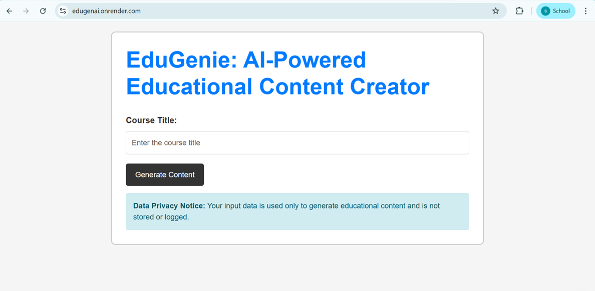
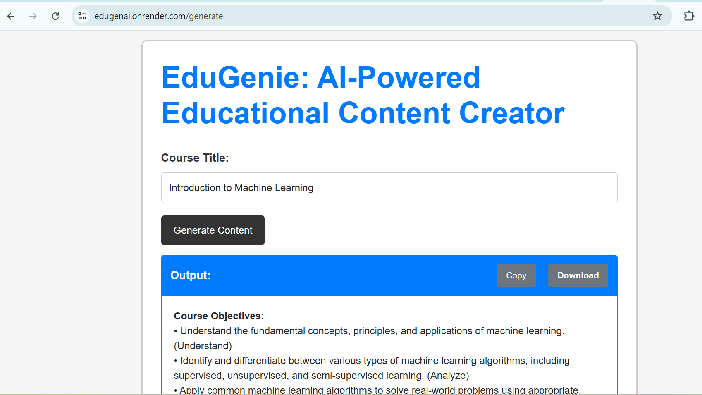

# 🌟 EduGenAI — AI-Powered Course Content Generator 🎓🤖

EduGenAI is a smart educational assistant that **automatically generates high-quality learning content** based on just a course title. Whether you're a student, educator, or lifelong learner, EduGenAI helps you get instant access to structured study materials, explanations, and outlines — powered by AI.

## ✨ Key Features

- 📚 **Course-Aware Content Generation**  
  Enter any course title (e.g. _"Machine Learning"_, _"Organic Chemistry"_), and get structured content like:
  - Course objectives
  - Weekly syllabus
  - Measurable learning outcomes
  - Assessment methods
  - Recommended academic readings 

- 🤖 **Powered by Gemini API (Google AI)**
  Uses Google's **Gemini API** for intelligent and relevant content generation.

- 🚀 **Instant Results**  
  No sign-up, no clutter — just type and learn.

- 🌐 **Web-based UI**  
  Responsive and simple interface built for quick use.

---

## 🧪 Demo

> 🔗 [Website Link](https://edugenai.onrender.com/)  

 
> Example: Typing **“Introduction to Machine Learning”** gives you core topics like behaviorism, cognitive development, and neural structures — all in seconds.

> 🔍 *This image illustrates the final output generated by EduGenAI, where personalized educational content is dynamically displayed based on user input.*

---

## 🛠️ Tech Stack

| Frontend   | Backend       | AI Model  | Hosting |
|------------|---------------|-----------|---------|
| HTML/CSS/JS| Python (Flask)| Gemini API| Render  |

